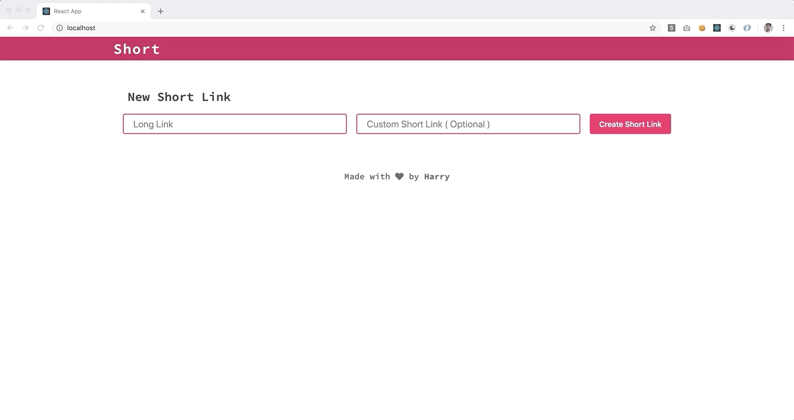

# Short


## Preview


## Want `s/` extension?
Get it [here](https://chrome.google.com/webstore/detail/short/hoobjcdfefnngjeepgjkiojpcicciihc)!

## Prerequisites
- Node.js v12.7.0
- Yarn v1.17.3

## Getting Started
### Create reCAPTCHA account
[sign up for an API key pair](http://www.google.com/recaptcha/admin)

### Create .env file at project root directory with the following content:
```bash
DOCKER_IMAGE_PREFIX=local
DB_USER=your_db_user
DB_PASSWORD=your_db_password
DB_NAME=your_db_name
RECAPTCHA_SECRET=your_recaptcha_secret
WEB_PORT=80
API_PORT=8080
```
Remember to replace the appropriate lines with your db user, db password, db name, and reCAPTCHA secret.

### Build docker image
```bash
GRAPHQL_BASE_URL=http://localhost:8080 HTTP_API_BASE_URL=http://localhost RECAPTCHA_SITE_KEY=your_recaptcha_site_key ./bin/build-web-dev docker build -t short:latest .
docker build -t local/short:latest .
```
Remember to replace the appropriate line with your reCAPTCHA site key.

### Start server
```bash
docker-compose up
```

3. Visit [http://localhost](http://localhost)

## Author
Harry Liu - [byliuyang](https://github.com/byliuyang)

## License
This project is maintained under MIT license
